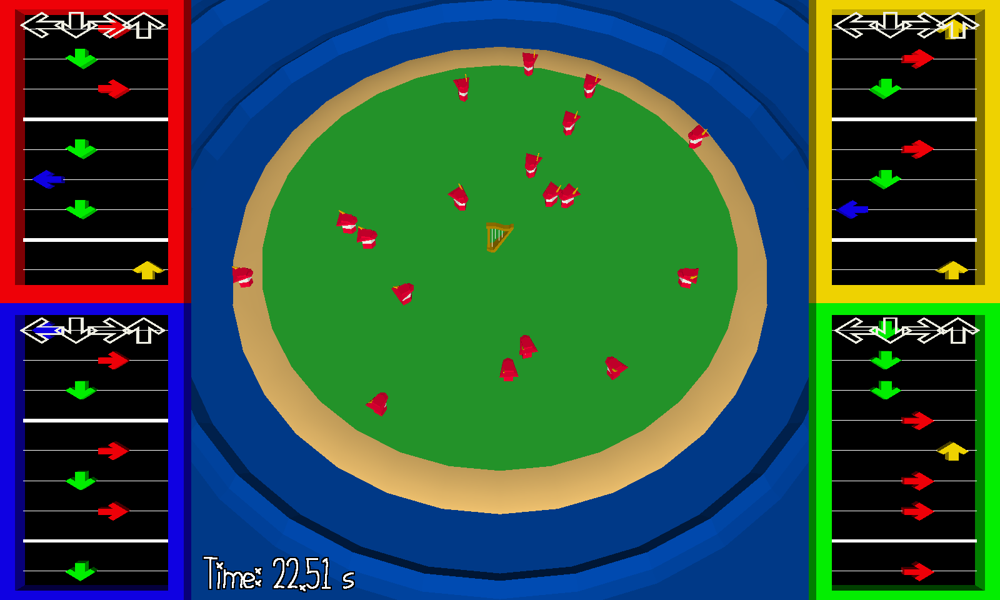

# Heaven's Harp

Author: Greg Loose

Design: Heaven's Harp is a rhythm / action game where you control a magical harp that has fallen from the sky onto a deserted island, attracting hordes of treasure hunters seeking to lay claim to your power. Play music to the beat, choosing from four songs with unique effects to protect yourself from the invaders and survive as long as you can.

Screen Shot:

How To Play:

## Controls
* WASD: Play notes
* R: Restart

## Instructions
* Play the first note of any of the four songs to start playing that song.
* Tap the corresponding WASD directional keys to play each note when it reaches the white note outlines at the top of the song track (or, if you're playing with audio, when you hear the beat sound).
  * If you play the wrong note, or play too far off the beat, the song ends.
* Each song has several "breaks" where no note is played on the beat. You may play any note on the beat during a break to activate the special power of the song in the direction of that note.
  * The song continues after using a power, and each subsequent break until the end of the song enables a stronger version of the power.
* Enemies appear at the edge of the island and slowly advance towards you. The game ends when any enemy touches you.
  
## Songs
From top left to bottom right:

### Song of Fire
Shoot a beam of fire, killing the nearest enemy in the chosen direction. Unlike other songs, the Song of Fire does not grow stronger when you play more of it. However, the end of the song features four breaks in rapid succession, allowing you to kill many enemies very quickly if you make it that far.

### Song of Wind
Teleport in a straight line in the chosen direction. The teleport distance increases the more you play. Note that, as with any song, you are free to skip a break if you would prefer to wait for a later break with a longer teleport; this may be necessary if you are surrounded by enemies at a close distance.

### Song of Water
Create a pool of water in the chosen direction that halves the speed of enemies inside it. The pool grows larger and lasts longer the more you play. This song does no damage, but is good for buying time if you find yourself with a moment to spare, especially at the start of the game. Only one pool can be active at a time.

### Song of Earth
Lift a chunk of earth in a cone in the chosen direction, tossing all enemies into the air and killing them on impact. The cone grows larger the more you play. Compared to the Song of Fire, this song is relatively long and complex, with fewer breaks, but is good for clearing large groups of enemies at short to medium range.

This game was built with [NEST](NEST.md).

